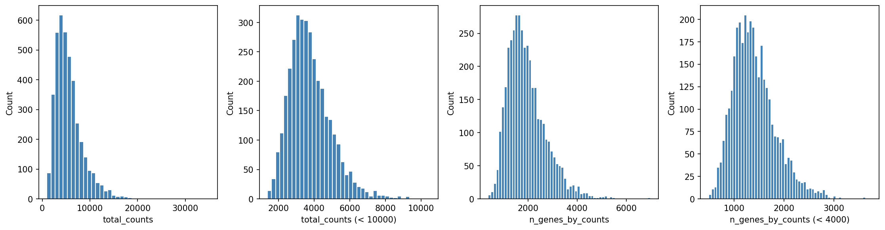
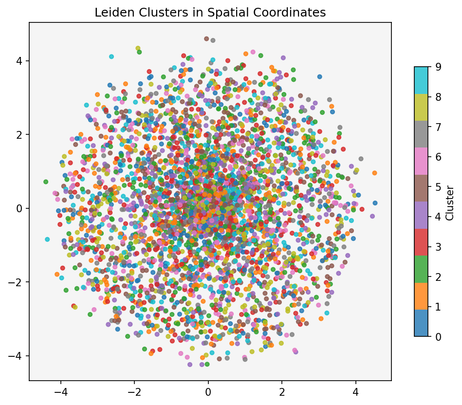
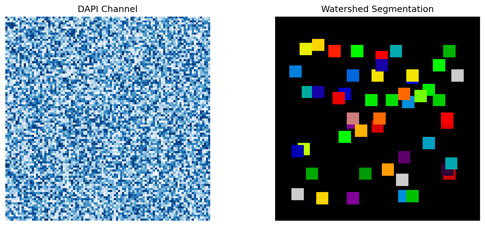
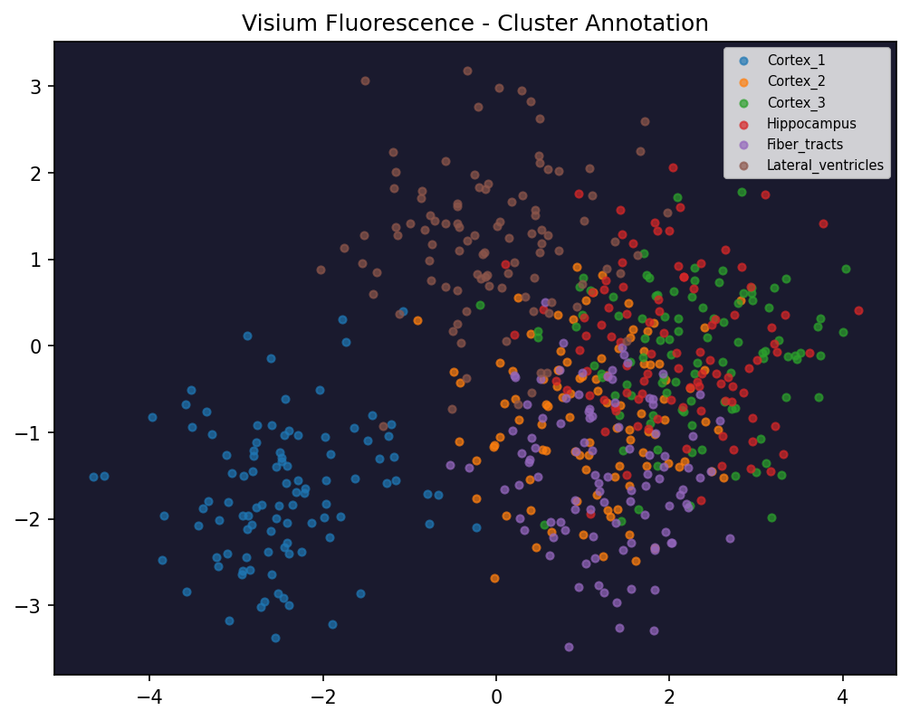
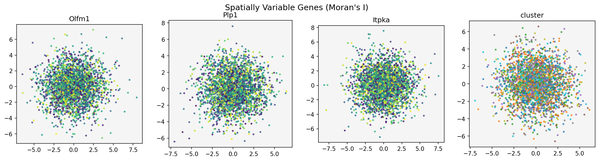
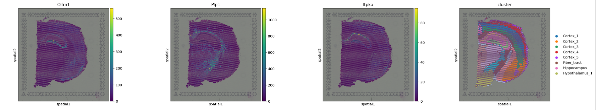
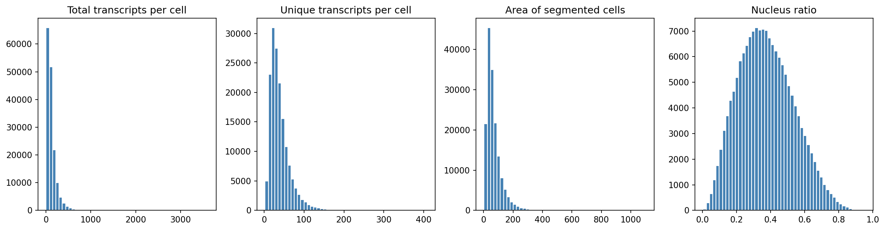
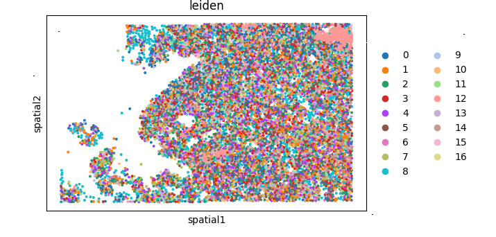

<div align="center">

# Spatial Transcriptomics Analysis

**Four end-to-end workflows linking gene expression to tissue architecture**

[](https://python.org)
[](https://scanpy.readthedocs.io)
[](https://squidpy.readthedocs.io)
[](https://spatialdata.scverse.org)

</div>

---

## Overview

Spatial transcriptomics answers a question that bulk and single-cell RNA-seq cannot: **where** in a tissue are genes expressed? This repository covers four major spatial platforms — from 55 µm Visium spots to subcellular Xenium in-situ sequencing — with fully annotated pipelines and publication-quality outputs.

---

## Repository Structure

```
spatial-transcriptomics/
│
├── assets/
│   └── images/                       # Output figures (referenced in this README)
│       ├── scanpy_qc.png
│       ├── scanpy_clusters.png
│       ├── visium_fluo_segmentation.png
│       ├── visium_fluo_clusters.png
│       ├── hne_moran_genes.png
│       ├── hne_clusters.png
│       ├── xenium_qc.png
│       └── xenium_clusters.png
│
├── requirements.txt
├── .gitignore
└── README.md
```

---

## Workflows

| # | Analysis | Platform | Tissue | Resolution |
|---|----------|----------|--------|------------|
| 01 | [Basic Scanpy](#01-basic-spatial-analysis) | 10x Visium | Human Lymph Node | ~5–20 cells / spot |
| 02 | [Visium Fluorescence](#02-visium-fluorescence-analysis) | 10x Visium | Mouse Brain | ~5–20 cells / spot |
| 03 | [H&E Spatial Statistics](#03-he-spatial-statistics) | 10x Visium | Mouse Brain | ~5–20 cells / spot |
| 04 | [Xenium Single-Cell](#04-xenium-single-cell-analysis) | 10x Xenium | Human Lung Cancer | Single cell |

---

## 01 Basic Spatial Analysis

The canonical entry-point workflow. Loads a public 10x Visium human lymph node dataset and walks through every step from raw counts to spatially resolved cluster maps.

**Pipeline**

| Step | What happens |
|------|-------------|
| Load | `sc.datasets.visium_sge("V1_Human_Lymph_Node")` — fetches data + H&E image |
| QC | Flag MT genes; filter spots on `total_counts` (5k–35k) and `pct_counts_mt < 20`; remove genes in < 10 spots |
| Normalize | `normalize_total` → `log1p` → 2,000 HVGs (Seurat flavor) |
| Embed | PCA → KNN graph → UMAP |
| Cluster | Leiden (igraph, undirected, 2 iterations) |
| Visualize | Clusters and QC metrics overlaid on H&E; crop zoom on clusters 5 & 9 |
| Markers | `rank_genes_groups` t-test; spatial maps of `CR2`, `COL1A2`, `SYPL1` |

**Results**

<table>
<tr>
<td align="center"><b>QC Distributions</b></td>
<td align="center"><b>Spatial Clusters on H&amp;E</b></td>
</tr>
<tr>
<td></td>
<td></td>
</tr>
</table>

**Key finding:** Leiden clusters recover anatomically coherent lymph node compartments (B-cell follicles, T-cell zones, stromal regions) that align with histological regions on the H&E image. `CR2` marks the follicular mantle zone; `COL1A2` and `SYPL1` localise to connective tissue and sinusoids respectively.

---

## 02 Visium Fluorescence Analysis

Shows how morphological image features from fluorescence channels can drive clustering independently of — and complementary to — gene expression.

**Pipeline**

| Step | What happens |
|------|-------------|
| Load | `sq.datasets.visium_fluo_image_crop()` — multi-channel fluorescence + pre-clustered AnnData |
| Preprocess | Gaussian smoothing on raw image (`sq.im.process`) |
| Segment | Watershed on DAPI channel (`sq.im.segment`) to delineate cells |
| Extract features | Summary stats, texture, histogram features at scales 1.0 and 0.25; segmentation features (cell count, mean channel intensity) |
| Cluster | Independent Leiden clustering per feature type (summary / histogram / texture); scale before PCA |
| Compare | Image-derived clusters vs. gene-expression clusters side-by-side |

**Results**

<table>
<tr>
<td align="center"><b>Watershed Segmentation</b></td>
<td align="center"><b>Image-Based Clusters</b></td>
</tr>
<tr>
<td></td>
<td></td>
</tr>
</table>

**Key finding:** Summary and texture-based image clusters partially overlap with transcriptomic clusters but diverge at tissue boundaries, where cell morphology changes before gene expression differences become detectable — demonstrating the value of multi-modal spatial analysis.

---

## 03 H&E Spatial Statistics

The most analytically rich workflow. Moves beyond clustering to apply formal spatial statistics, testing how cell populations are organized relative to one another in tissue.

**Pipeline**

| Step | What happens |
|------|-------------|
| Load | `sq.datasets.visium_hne_adata()` — mouse brain with annotated clusters |
| Image features | Summary features at scales 1.0 and 2.0; combine and cluster |
| Spatial graph | `sq.gr.spatial_neighbors` — KNN graph in physical space |
| Neighborhood enrichment | Z-score test for cluster co-localization beyond chance |
| Co-occurrence | Cluster proximity scores across distance radii (Hippocampus focus) |
| Ligand–receptor | `sq.gr.ligrec` permutation test (100 perms); Hippocampus → Pyramidal layer |
| Moran's I | Spatial autocorrelation scored on top 1,000 HVGs (100 permutations) |

**Results**

<table>
<tr>
<td align="center"><b>Top Moran's I Genes</b></td>
<td align="center"><b>Spatial Clusters</b></td>
</tr>
<tr>
<td></td>
<td></td>
</tr>
</table>

**Key finding:** `Olfm1`, `Plp1`, and `Itpka` rank among the highest Moran's I genes, meaning their expression is tightly coupled to anatomical boundaries rather than being stochastically distributed. Neighborhood enrichment confirms strong spatial association between Hippocampus and Pyramidal layer clusters, supported by significant ligand–receptor interactions at their interface.

---

## 04 Xenium Single-Cell Analysis

Analyzes 10x Xenium in-situ sequencing data at true single-cell resolution. Unlike Visium, Xenium assigns every transcript to a segmented cell, eliminating the need for spot deconvolution and enabling cellular-resolution mapping of the tumor microenvironment.

**Pipeline**

| Step | What happens |
|------|-------------|
| Ingest | `spatialdata_io.xenium()` converts raw output to SpatialData zarr store |
| QC | Control probe rate, negative codeword rate; filter on UMI distributions and cell area |
| Filter | `min_counts=10` per cell; `min_cells=5` per gene |
| Normalize | Store raw counts → `normalize_total` → `log1p` → PCA → UMAP → Leiden |
| Spatial graph | Delaunay triangulation in physical coordinates |
| Centrality | Closeness, betweenness, degree centrality per cluster |
| Co-occurrence | Computed on 50% subsample; cluster 12 focus |
| Neighborhood enrichment | Adjacency z-scores on full dataset |
| Moran's I | Top spatially patterned genes on subsample (100 perms) |
| Visualize | `AREG` and `MET` spatial scatter; optional napari interactive viewer |

**Results**

<table>
<tr>
<td align="center"><b>QC Distributions</b></td>
<td align="center"><b>Single-Cell Spatial Clusters</b></td>
</tr>
<tr>
<td></td>
<td></td>
</tr>
</table>

**Key finding:** Single-cell resolution reveals spatially segregated tumor microenvironment niches — immune infiltrates, cancer cells, and stromal populations form distinct spatial domains detectable without deconvolution. `AREG` (EGFR ligand) and `MET` show strong spatial autocorrelation and localize to specific cellular neighborhoods, suggesting spatially organized oncogenic signaling.

---

## Methods Summary

| Method | Used in | Purpose |
|--------|---------|---------|
| `normalize_total` + `log1p` | All | Remove sequencing depth bias |
| Highly Variable Genes (Seurat) | 01, 04 | Feature selection |
| PCA | All | Linear dimensionality reduction |
| UMAP | 01, 04 | 2D non-linear embedding |
| Leiden clustering | All | Graph-based community detection |
| Spatial neighbor graph | 02, 03, 04 | Encodes physical tissue adjacency |
| Watershed segmentation | 02 | Cell delineation from DAPI channel |
| Image feature extraction | 02, 03 | Morphological summary / texture / histogram features per spot |
| Neighborhood enrichment | 03, 04 | Tests spatial co-localization of cluster pairs |
| Co-occurrence scoring | 03, 04 | Cluster proximity across distance scales |
| Ligand–receptor (`ligrec`) | 03 | Permutation test for intercellular signaling |
| Moran's I | 03, 04 | Spatial autocorrelation of gene expression |
| Centrality scores | 04 | Graph-theoretic importance per cluster |
| SpatialData | 04 | Unified multi-modal spatial container |

---

## Installation

```bash
# 1. Clone
git clone https://github.com/your-username/spatial-transcriptomics.git
cd spatial-transcriptomics

# 2. Create virtual environment
python -m venv venv
source venv/bin/activate      # macOS / Linux
# venv\Scripts\activate       # Windows

# 3. Install dependencies
pip install -r requirements.txt
```

---

## Technologies

<div align="center">

[Scanpy](https://scanpy.readthedocs.io) · [Squidpy](https://squidpy.readthedocs.io) · [SpatialData](https://spatialdata.scverse.org) · [AnnData](https://anndata.readthedocs.io) · [10x Genomics](https://www.10xgenomics.com/spatial-gene-expression)

</div>
